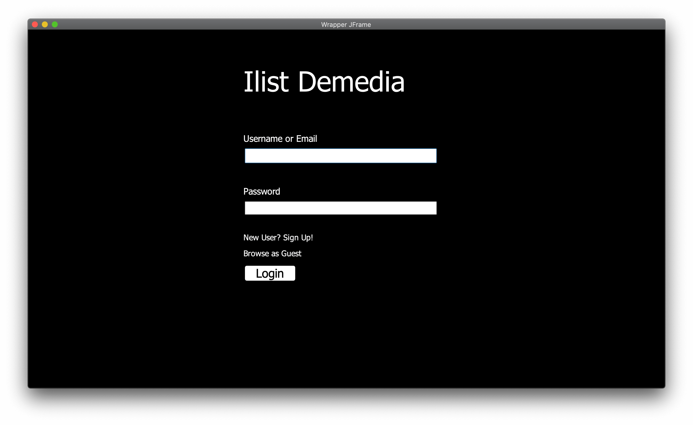

# trackr

## Table of Contents
* [Description](#description)
* [Features](#features)
* [Finished Project Images](#finished-project-images)
* [Credits](#credits)
* [License](#license)

## Description
A group project done with seven partners in Eclipse. It involved an agile (SCRUM) development approach alongside the version control GIT. The program uses the Model-View-Controller (MVC) Pattern, Object-Oriented Programming (OOP), Swing Components (JFrames, JObjects, etc.), and a database programmed in MongoDB to create a TV-Show-Tracker. The software aims to store, access, manage, and manipulate a set of data that specifically relates to TV shows and movies that users have watched or would want to watch.

## Features
* Easy listing of shows and movies
    * Sorting by attributes and filter (i.e. name, rating, genre, etc...)

* Online and offline access
    * Sync between desktop and mobile app

* Smart recommendation system
    * Find new shows that are recommended by users or based on your watched
      list
    
* Online messaging hub for users to chat with friends
    * Share lists to friends via hyperlink or in-app link

* 5 star rating and review system publicly available for watched shows

* Manage private and public lists
    * Create and categorize different types of lists

## Finished Project Images
* [Login Screen](#login-screen)
* [Registration Screen](#registration-screen)
* [Profile Screen](#profile-screen)
* [Main Screen](#main-screen)
* [Show Screen](#show-screen)
* [Chat Screen](#chat-screen)

### Login Screen

### Registration Screen

### Profile Screen

### Main Screen

### Show Screen

### Chat Screen

## Credits
Thanks to Faiz Chaudhry for the remarkable idea for Trackr.

All development and creative credits go to the following:

#### Front end developers
* Andrew Jiang
* Daniel Gabriele

#### Back end developers
* Juwon Obatolu
* Faiz Chaudhry

#### Full stack developers
* Michelle Wong
* Jaskarn Mankoo
* Clarenz Caba

License
-------
This project is licensed under the MIT License - see the [LICENSE](../LICENSE) file for details.
